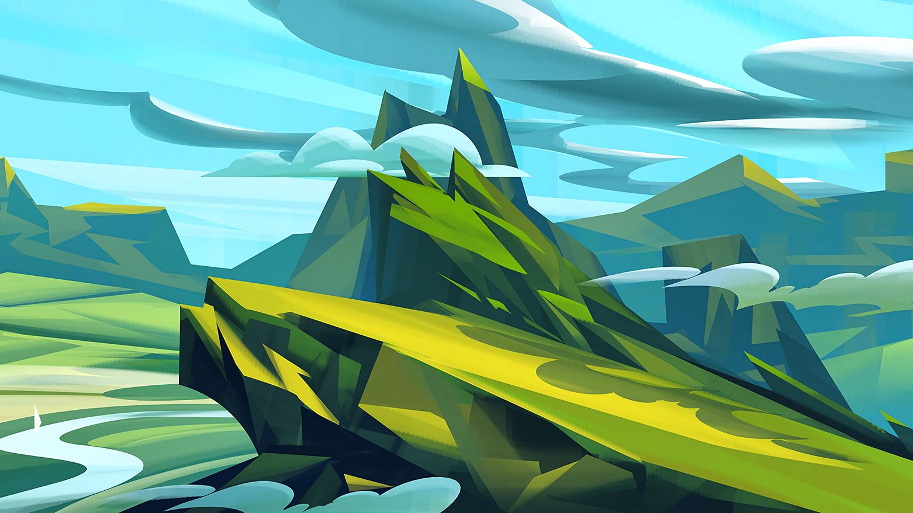

# NİŞANTAŞI ÜNİVERSİTESİ GRAFİK TASARIM NOTLARI

## Haftanın Görevleri
- [ ] **Araştıralacak İsimler**
> Melike Taşçıoğlu\
Yeşim Demir\
Mengü Ertel\
Yurdaer Altıntaş\
Esen Karol\
İrma Boom\
Paul Klee\

- [ ] **İncelenecek Web Sayfaları**
> [Manifold](https://manifold.press)\
[GMK](http://gmk.org.tr/publications)

- [ ] **İncelenecek Dergiler**
> Grafik Tasarım (Mobil Dergilikler ve D&R)

- [ ] **Alınacak Malzemeler**
> 50X70 Bristol,\
Şöhler Kağıt 300gr,\
Eskiz Kağdı (Fotokopi Kağıtları Olabilir),\
Gönye,\
Pistole Takımı,\
Maket Bıçağı,\
02,03,05 Uçlu Kurşun Kalem,\
Rapıdo kalem ve siyah Mürekkep,\
70cm Cetvel 50 CM DURALİT,\
Kağıtları Tutturmak İçin Mandal.\
\
**LİSTEYE EKLENECEK OLAN İHTİYAÇ DOĞRULTUSUNDA Kİ MALZEMELER DERS AŞAMASINDA BİLGİLENDİRİLECEKTİR.**

> Aslı Hoca: _"Edinmeniz gereken malzemelerden bir değeri 35x50 cm resim kağıdı duvarınıza asıp çizgi çalışması yapmanız için gerekli. **2B 3 4 5B** alabilirsiniz ayrıca ton skalası yapmak için gerekli."_

## Geçmiş Görevler
> **UPS, SANIRIM GEÇMİŞ GÖREV YOK!**

## Sınav Tarihleri
> **YAVAŞ, HER ŞEYİN BİR SIRASI VAR! :)**

## Önemli Notlar
> _"Bol bol desen alıştırması."_ **Zafer Hoca**